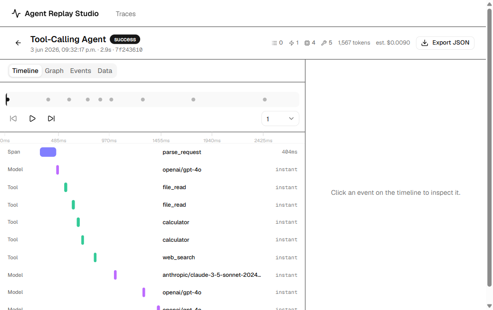
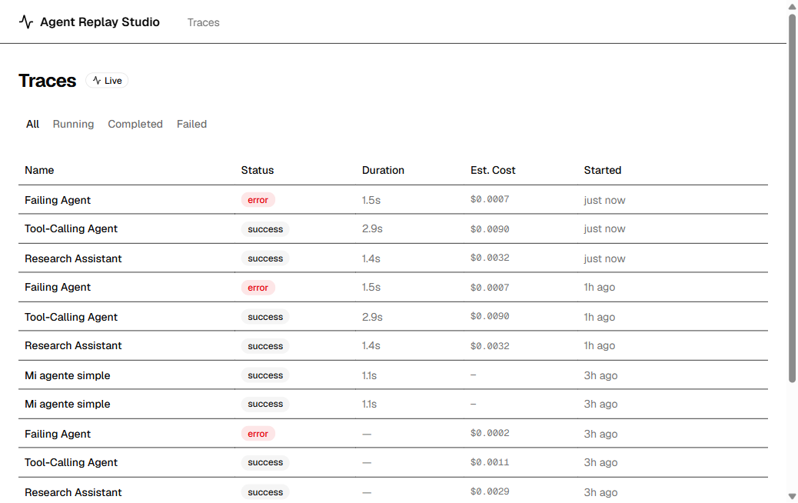
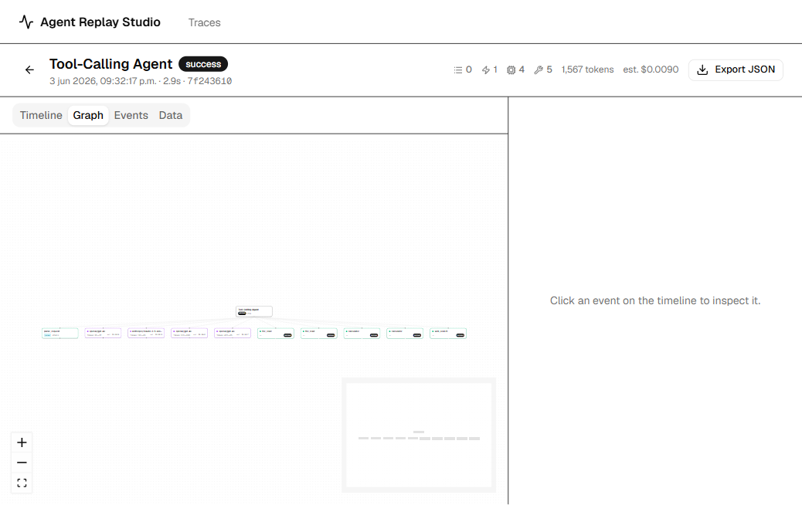
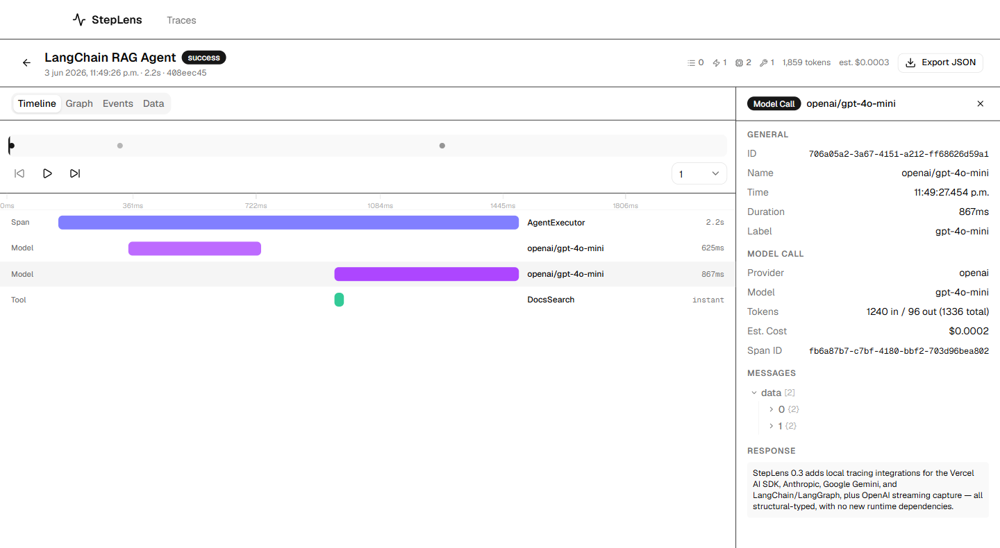

# StepLens

[](https://github.com/fabriutola-hub/StepLens/actions/workflows/ci.yml)


**A local-first trace inspector for AI agents.** Record what your agent did —
spans, model calls, tool calls, errors, tokens, and estimated cost — and explore
it in a local web UI as a timeline, a graph, or step-by-step.

Everything runs on your machine. No accounts, no cloud, no API keys. Traces are
stored in a local SQLite file (`~/.agent-replay/studio.db`).

> **What "replay" means here:** stepping through a recorded trace event-by-event
> (play / pause / step / seek) to see what happened. It is **not** deterministic
> re-execution of your agent.



---

## Quickstart

**install → start Studio → demo → see trace.** Requirements: **Node.js ≥ 18**
and **pnpm 11** (`corepack enable`).

```bash
pnpm install && pnpm build   # 1. install + build
pnpm dev                     # 2. start Studio → http://localhost:3000  (leave running)
pnpm agent-replay demo       # 3. (new terminal) record 3 example traces
```

Now open **http://localhost:3000** — the traces appear and the list
auto-refreshes. Click one to explore it.

| Trace list | Graph view |
| --- | --- |
|  |  |

Want your own first trace? Scaffold and run an example:

```bash
pnpm agent-replay new simple   # writes agent-replay-example.mjs
node agent-replay-example.mjs  # records a "Simple Agent" trace
```

---

## Record from your own agent

The simplest way (recommended) is the `@agent-replay/sdk/simple` API:

```ts
import { createReplay } from "@agent-replay/sdk/simple";

// Defaults to http://localhost:3000; reads AGENT_REPLAY_ENDPOINT / AGENT_REPLAY_ENABLED.
const replay = createReplay();

await replay.record("My Agent", async (run) => {
  const docs = await run.step("Search docs", async () => searchDocs());

  const answer = await run.model(
    "openai:gpt-4o",
    { messages: [{ role: "user", content: "Summarize the docs" }] },
    async () => callModel(docs), // return { response, inputTokens, outputTokens }
  );

  return answer.response;
});

await replay.shutdown(); // flush before exit
```

- `run.step(name, fn)` — an auto-managed span (nests naturally).
- `run.tool(name, input, fn)` — records a tool call's input/output.
- `run.model("provider:model", opts, fn)` — records a model call + estimated cost.

Using a real LLM stack? Wrap your client/functions once and calls made inside
`record()` are captured automatically — spans, model calls, tool calls,
completed streams, tokens, and estimated cost:

```ts
import { wrapOpenAI } from "@agent-replay/sdk/integrations/openai";
const openai = wrapOpenAI(new OpenAI(), { replay });
```

### Integrations

| Integration | Import | Wrap | Streaming | Template |
| ----------- | ------ | ---- | --------- | -------- |
| **OpenAI** | `@agent-replay/sdk/integrations/openai` | `wrapOpenAI(client)` | `stream: true` (recorded when fully consumed) | `agent-replay new openai` |
| **Vercel AI SDK** | `@agent-replay/sdk/integrations/vercel-ai` | `wrapAISDK({ generateText, streamText, … })` | `streamText` / `streamObject` via `onFinish` | `agent-replay new vercel-ai` |
| **Anthropic** | `@agent-replay/sdk/integrations/anthropic` | `wrapAnthropic(client)` | `messages.stream(…).finalMessage()` | `agent-replay new anthropic` |
| **Google Gemini** | `@agent-replay/sdk/integrations/google` | `wrapGoogleGenAI(client)` | `generateContentStream` (recorded when fully consumed) | `agent-replay new google` |
| **LangChain / LangGraph** | `@agent-replay/sdk/integrations/langchain` | `createLangChainCallbackHandler()` | via LangChain callbacks | `agent-replay new langchain` |
| **Ollama** | — (use `run.model("ollama:…")`) | — | — | `agent-replay new ollama` |

All integrations use **structural types only** — none of `openai`, `ai`,
`@anthropic-ai/sdk`, `@google/genai`, or `@langchain/*` are dependencies of the
SDK. You pass in your real client/functions; outside `record()` everything
passes through untouched, and **streams are never consumed on your behalf**.

A LangChain agent recorded with `createLangChainCallbackHandler()` — spans,
model calls, tool calls, tokens, and estimated cost:



The lower-level `createClient` / `Trace` / `Span` API is still fully supported.
Full details in [`docs/sdk.md`](docs/sdk.md).

---

## Run Studio with Docker

To run Studio outside the monorepo, use the bundled `Dockerfile`:

```bash
docker build -t steplens .
docker run --rm -p 3000:3000 -v steplens-data:/data steplens
```

Then point the SDK/CLI at `http://localhost:3000` as usual. The volume persists
the local SQLite database across runs.

---

## What's in the box

| Package | Description |
| ------- | ----------- |
| [`@agent-replay/sdk`](packages/sdk) | Recording client — simple API (`createReplay`), core API (`createClient`), integrations |
| [`@agent-replay/core`](packages/core) | Shared types, Zod schemas, and (static) model cost lookup |
| [`@agent-replay/cli`](packages/cli) | The `agent-replay` command (`new`, `demo`, `record`, `import`, `export`, `dev`, `doctor`, `init`) |
| `@agent-replay/studio` | The Next.js UI + ingest/query/import API (runs at `localhost:3000`) |
| `@agent-replay/examples` | Demo agents used by `agent-replay demo` (bundled into the CLI) |

See [`docs/architecture.md`](docs/architecture.md) for how data flows.

---

## Documentation

- [Quickstart](docs/quickstart.md) — clone → first trace, in detail
- [SDK](docs/sdk.md) — simple API, core API, env vars, integrations
- [CLI](docs/cli.md) — every command, with examples
- [Architecture](docs/architecture.md) — packages, data model, costs, storage
- [Comparison](docs/comparison.md) — vs LangSmith, Helicone, OpenTelemetry
- [Roadmap](ROADMAP.md)

---

## Costs and tokens

Studio shows **estimated** cost in **US dollars** (e.g. `$0.0075`), labeled
"Est.". Pricing comes from a **static, hand-maintained table** in
`@agent-replay/core` and will drift as providers change prices — treat costs as
rough estimates, not billing figures. Unknown models simply show no cost.

---

## Troubleshooting

| Symptom | Fix |
| ------- | --- |
| `agent-replay demo` says "Studio is not reachable" | Start Studio first: `pnpm dev`. Confirm it's at `http://localhost:3000`. |
| Port 3000 in use | Run Studio on another port (`pnpm --filter @agent-replay/studio dev -- -p 3001`) and pass `-e http://localhost:3001` to CLI commands. |
| No traces appear | The list auto-refreshes every few seconds. Make sure your SDK client points at the same endpoint and that you call `await replay.shutdown()` before exit. |
| Not sure your setup is healthy | Run `pnpm agent-replay doctor`. |
| Want a clean slate | Delete `~/.agent-replay/studio.db` (and `-wal`/`-shm` files). |

---

## Project status

It is **local-first** and intentionally has **no
authentication, accounts, or cloud** — do not expose it to an untrusted network
(see [`SECURITY.md`](SECURITY.md)). The `0.2` SDK API is unchanged; APIs may
still evolve before `1.0`.

Contributions welcome — see [`CONTRIBUTING.md`](CONTRIBUTING.md). Licensed under
[MIT](LICENSE).
